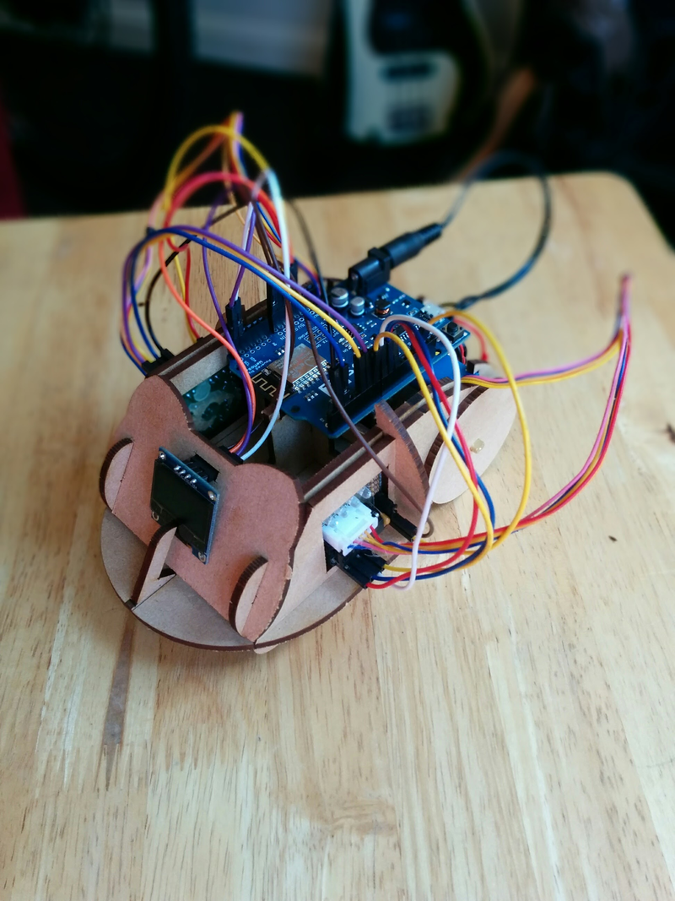

# [Hedgehog Bot](http://hedgehogbot.digimakers.co.uk)

[](http://hedgehogbot.digimakers.co.uk)

The Hedgehog bot is a robotic platform powered by the
[ESP8266](http://espressif.com/en/products/hardware/esp8266ex/overview)-based
[Wemos D1 R2](https://wiki.wemos.cc/products:d1:d1) development board.

Notable Features:
* Full laser cut MDF construction
* Dual servo motor drive
* 128x64 OLED display
* WiFi (client and access point modes)

Instructional videos are available on [YouTube](https://www.youtube.com/playlist?list=PLFSZW1PcP6gNI3f4X1cLMgz0ljdSJu5kU)

If you're interested in learning more, visit the hedgehog bot website:
http://hedgehogbot.digimakers.co.uk 

If you're a volunteer or workshop lead who wants to learn more, check out the
[facilitator notes](#facilitator-notes)

----

## Software setup

### Prerequisites

* [CH340 Drivers](http://www.nerdkits.com/usb-serial/ch341.php)

### Installation
#### Windows or Mac OS X
1. Copy `hhb_blink`, `hhb_bot`, and `hhb_wifi` from `sketches` into your Arduino sketchbook folder
2. Copy the folders in `libraries` to the `libraries` folder in your Arduino
   sketchbook folder, if it doesn't already exist you can just copy and paste
   the `libraries` folder straight into the sketchbook folder.
3. Verify that when you run the Arduino IDE and click the menu options `File -> Sketchbook`
   you can now see:
   - `hhb_blink`
   - `hhb_bot`
   - `hhb_wifi`

#### Linux (Raspberry Pi)

```sh
$ git clone --recursive https://github.com/MVSE-Outreach/arduino-hedgehog-bot.git hedgehog-bot
$ cd hedgehog-bot
$ ./install.sh <PATH-TO-ARDUINO-SKETCHBOOK>
```

----

## Facilitator notes

Most things are documents within the `docs` folder in the repository including:

* Instructions on ordering parts: [docs/kit-ordering.md](docs/kit-ordering.md)
* Troubleshooting: [docs/troubleshooting.md](docs/troubleshooting.md)
* Preparing a workshop: [docs/preparing-a-workshop.md](docs/preparing-a-workshop.md)
* Components used in the Hedgehog bot: [docs/components.md](docs/components.md)

### Laptop setup

* Download the laptop setup script.
* Copy the script over to a memory stick.
* Run the script to set up a computer **at least once** to download the
  necessary dependencies.
* Copy the script along with the files and folders adjacent to the script that
  it downloaded in the previous step to other memory sticks used to set up
  laptops.
* Run the script from the memory stick on all other laptops that need setting
  up, after the first run the dependencies will be downloaded so subsequent
  setups should be much faster.


----

## Known issues
- Arduino Nano not recognised: Have you installed CH340 drivers?
- WiFi not working: Test 9V battery

See the [troubleshooting docs](/docs/troubleshooting.md) for more
