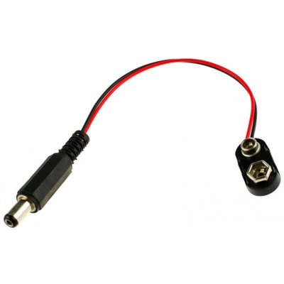
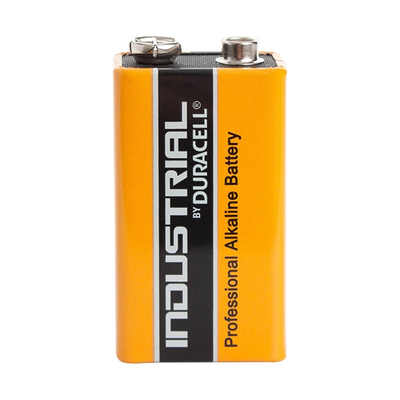
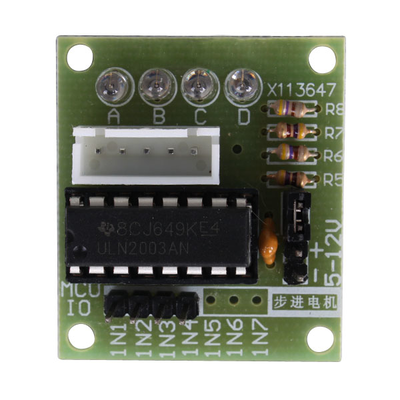
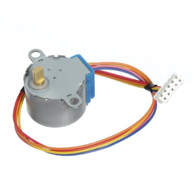
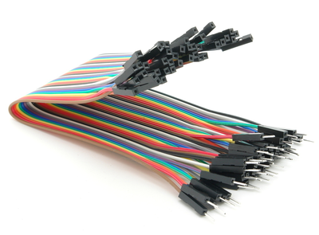
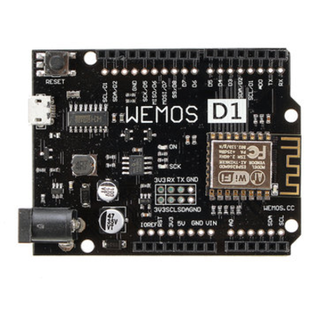
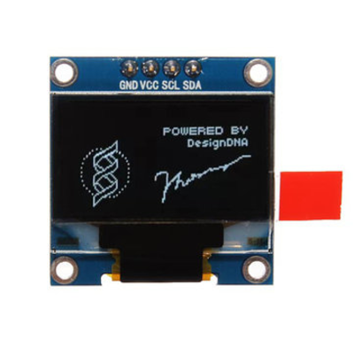
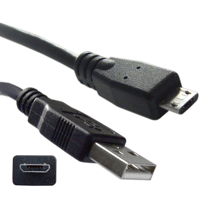

# Ordering in bulk to produce a kit

## Part list

| Part image | Part | Quantity per bot | Comments |
|------------|------|------------------|----------|
|  | 9V Lead with barrel jack | 1 | Make sure you get leads with a barrel jack |
|  | 9V battery | 1 | Sometimes kids go through more than a single battery in a single session |
|  | ULN2003 Stepper motor driver board | 2 | Needs to be this exact board as the body is designed for it |
|  | 28YBJ-48 Stepper motor | 2 | |
|  | Male to female dupont jumper cable | 20 | |
|  | Wemos D1 R2 (v2.1.0) | 1 | |
|  | I2C 128x64 0.96" OLED screen | 1 | 4 pins (GND, VCC, SCL, SDA) |
|  | Micro USB cable | 1 | Observed about a 5% failure rate in the cheap one we buy |
